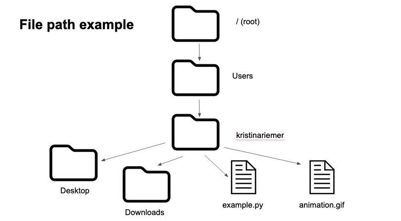

# Review of last week

- What happened as you were trying to re-organize projects or R code? 
  - Victories? 
  - Stumbling blocks?

# Learning objectives

-   Understand the what and why of the shell
-   Interact with the shell using common commands
-   Find help via --help, man, and online help pages
-   Navigate your file system from the command line
-   (Time permitting) Manipulate and move files from the command line

# What is the shell?

- Command-line interface, in contrast to a GUI

# Why learn the shell?

-   Be able to work with tools that don't have a GUI
-   Batch large tasks (e.g. renaming files)
-   Interact with remote computers like the University HPC

# Let's get set up! 

-   macOS comes with a shell (usually Bash or Zsh) built-in

-   Windows need to install GitBash (includes Bash shell and git, which we will use later)

- Breakout rooms

# Data download

- Download `shell-lesson-data.zip` 
  - Instructions here: <https://swcarpentry.github.io/shell-novice/index.html#download-files>
- Save it to your Desktop and unzip it.

# Coding time

- Intro to shell commands

# Syntax of a shell command

{fig-align="center"}

# Coding time

- File systems

# Example file system

# Example file system

# Homework for next time

-   Read ["Excuse me, do you have a moment to talk about version control?"](https://peerj.com/preprints/3159/)
- Create a diagram of your file system and note your most frequently used directories
